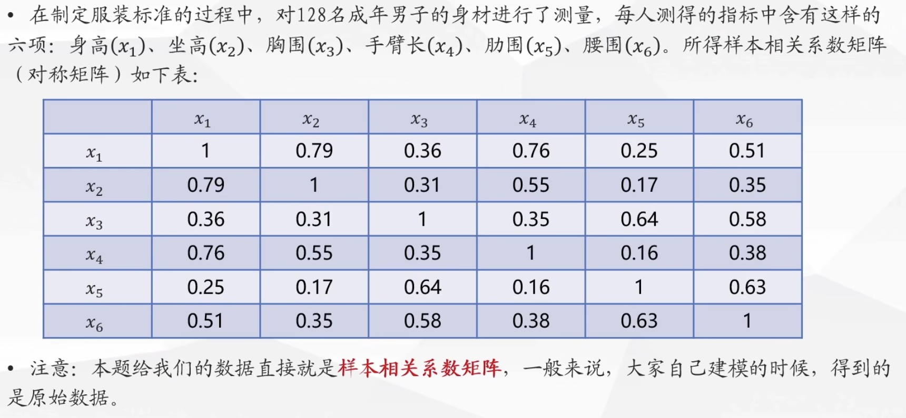

## 主成分分析

### 问题提出

在实际生活中，我们会遇到很多多变量问题。如果对每个变量一一讨论，那分析问题的复杂性会非常高。而且在很多实际问题中，多个变量之间是具有一定的相关关系的。因此，能否在相关分析的基础上用较少的新变量代替原来较多的旧变量，但是这些新变量却能尽可能多地保留原来变量所反映的信息？

举个简单的例子，服装厂做衣服不可能根据每一个客户的身体的详细数据(身长、袖长、腰围、肩宽、肩厚等数十项指标)进行一一定制。但是可以把多种指标综合成几个少数的综合指标，作为分类的型号。就比如可以将它们综合成3项指标，一项是反映长度的指标，一项是反应胖瘦的指标，一项是反映特殊体型的指标。

### 主成分分析

在研究多变量问题时，变量太多导致问题复杂性剧增。我们希望变量个数较少而得到的信息较多。变量之间是有一定的相关关系的，可以解释为两个变量反映此问题的信息有一定的重叠区域。主成分分析是对于原先提出的所有变量，将关系紧密的变量删去多余，尽可能建立少的新变量，使得这些新变量是两两不相关的，且这些新变量在反映课题的信息方面尽可能保持原有的信息。设法将原来变量重新组合成一组新的互相无关的几个综合变量，同时根据实际需要从中可以取出几个较少的综合变量尽可能多地反映原来变量的信息的统计方法叫做主成分分析或主分量分析，也是数学上用来降维的一种方法。

#### 数据降维

降维是将高维度的数据保留下最重要的一些特征，去除噪声和不重要的特征，从而实现提升数据处理速度的目的。

在实际的生产和应用中，降维在一定的信息随时范围内，可以为我们节省大量的时间和成本。降维也成为应用非常广泛的**数据预处理**方法。

降维有以下优点：

- 使得数据集更易使用
- 除噪声
- 降低算法的计算开销
- 使得结果容易理解

#### 主成分分析的原理

将特征维度变小，同时尽量减少信息损失。就是对一个赝本矩阵，一是换特征，找一组新的特征来重新标识；二是减少特征，新特征的数目要远小于原特征的数目。

通过PCA(主成分分析)将n维原始特征映射到k维($k<n$)上，称k维特征为主成分。强调一下，不是从n维特征中去除$n-k$个特征，而是重新构造出全新的k维**正交特征**。

那么如何找到新的维度呢？实质是数据间的方差够大，就是使数据到了新的维度基变换下，坐标点足够分散，数据间各有区分。

例如在上面左图中有5个离散点，降低维度，就是需要把点映射成一条线。将其映射到右图中黑色虚线上则样本变化最大，且坐标点更分散，这条黑色虚线就是**第一主成分的投影方向**。就是如果把黑色虚线当成新的坐标轴的话，所有点在轴上面运动只涉及一个量的变化，而原来x坐标和y坐标是同时变化的。在映射过程中，原来在虚线上的点不动，原来不在虚线上的点映射到虚线上距离原始位置最近的点处。

主成分分析就是通过某个投影矩阵将高维空间中的原始样本点线性投影到低维空间，以达到降维目的，线性投影是通过矩阵变换的方式把数据映射到最合适的方向。

降维的几何意义可以理解为旋转坐标系。

在大多数情况下，数据各个变量基本服从正态分布，所以变量为2的数据散点分布大致为一个椭圆，变量为3的散点分布大致为一个椭球，p个变量的数据大致分布在一个超椭圆。通过旋转坐标系，使得超椭圆的长轴落在一个坐标轴上，其次超椭圆另一个轴也尽量落在坐标轴上。这样各个新的坐标轴上的坐标值便是相应的主成分。

#### 主成分分析思想

1. 假设有n个样本，p个指标，则可构成大小为$n\times p$的样本矩阵$x$：

   $x=\begin{bmatrix}x_{11}&x_{12}&\cdots&x_{1p}\\x_{21}&x_{22}&\cdots&x_{2p}\\\vdots&\vdots& \ddots & \vdots\\x_{n1} & x_{n2} & \cdots & x_{np}\end{bmatrix}=\begin{pmatrix}x_1,x_2,\cdots,x_p\end{pmatrix}$

2. 假设我们想找新的一组变量，需满足：

解题步骤：

这里标准化的目的还是为了去除量纲的影响。

按照特征值的大小对特征向量进行排序。

贡献量就是新的主成分携带原有数据的信息量的多少。在这里就是每个特征值站特征值之和的比例。(这里打错了累计贡献率计算公式是$\sum G=\frac{\sum_{k=1}^{i}\lambda_k}{\sum_{k=1}^{p}\lambda_k}(i=1,2,\cdots,p)$。累计贡献率就是到目前为止之前所有计算过的贡献率之和。

用主成分分析来进行评价是比较少的，更多时候是用来进行聚类和回归分析。

### 例题

#### 例题1

主成分分析的缺点在于在降维后构造的新指标很难在总结出实际的意义。

#### 例题2

可以通过查找资料文献来解释第二主成分。（AI解释也不错）

