## 层次分析法

---

这是一种多准则决策方法可以用于对评价类问题进行打分。

在考虑一个问题时，往往要考虑不同的标准，来最终帮助我们做出选择。比如要选择地方进行旅游，对于候选的城市进行评分时涉及4个标准：

1. 景色
2. 花费
3. 饮食
4. 男女比例

层次分析法就是通过相互比较确定各准则对于目标的权重，以及各方案对于每一层准则的权重，这些权重往往在人的评价过程中是定性的(即**主观**的)，我们现在要将其进行**定量**分析。

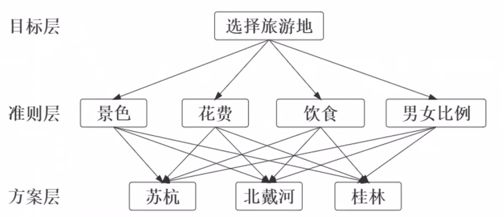

首先对于不同标准的重要程度，要有一个比较标准，以帮助我们确定权重，比较的尺度如下：

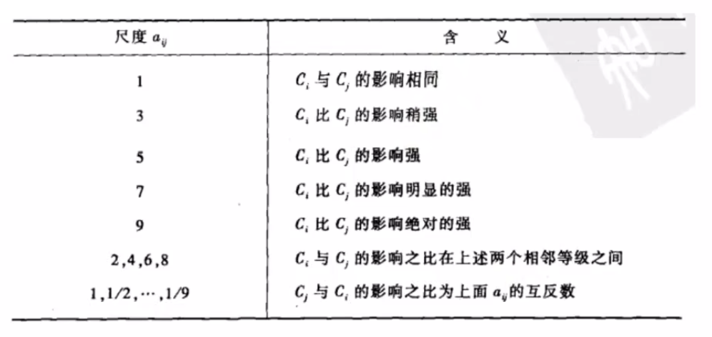

两个标准的影响程度有5个层次，分别是影响相同，影响稍强，影响强，影响明显的强和影响绝对的强。分别设置尺度为5个奇数，1,3,5,7,9，再在每两个奇数之间插入偶数2,4,6,8，用来表示相邻的等级之间的更细微的等级。那么由上表可以看出，这里我们只讨论了前者比后者更重要的情况，而后者比前者更重要的情况我们可以用上述尺度的倒数来表示，表格中的最后一行也给出了。

将所有标准进行两两比较，就可以得到指标重要性的表格：

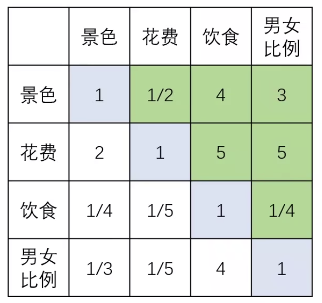

假设有n个标准，我们要执行$C^{2}_{n}$次比较。

通过这个表格，我们可以得到一个矩阵$\begin{bmatrix}1&\frac{1}{2}&4&3\\2&1&5&5\\\frac{1}{4}&\frac{1}{5}&1&\frac{1}{4}\\\frac{1}{3}&\frac{1}{5}&4&1\end{bmatrix}$

有以下补充：

1. $a_{ij}$的含义表示i相较于j的重要程度
2. 当i = j时，规定$a_{ij}=1$
3. 当且仅当$a_{ij}>0,a_{ij}\times a_{ji}=1$时，称该矩阵为正互反矩阵。

由准则层得到的矩阵称为**准则层判断矩阵**，有了判断矩阵，我们可以清晰的表示出各个评判指标之间的权重向量。

下面按照同样的评分方式，我们还可以确定候选方案在某一指标下的得分，如下表，进一步**方案层判断矩阵**：

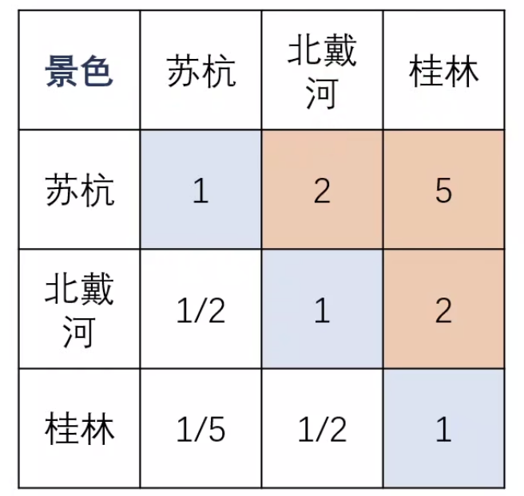

对于每一个指标，我们都可以得到类似的一张表格，最终结果如下：

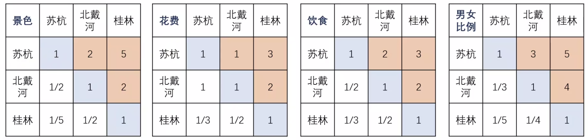

两种权重的定量方式均是通过同层之间的比较而确定的。

在权重计算的矩阵中，我们可以发现具体的数值并不是严格的比例，即苏杭：北戴河=2:1，苏杭：桂林=5:1，但是$北戴河:桂林 \ne \frac{5}{2}$，即满足$a_{ij}\sdot a_{jk}\ne a_{ik}$。这种矩阵我们称之为**不一致矩阵**。同理，也有**一致矩阵**的概念，即满足$a_{ij}\sdot a_{jk}=a_{ik}$一致矩阵有下列性质：

1. A的秩为1，A的唯一非零特征根为n；
2. A的任一列向量都是对于特征根n的特征向量。

通过性质1，我们可以轻松得知**只要每两行满足倍数关系，就是一致性矩阵**。

一致性矩阵可以帮我们检查矩阵的“矛盾问题”，在**使用判断矩阵之前一定要先检验其一致性**。

#### 一致性的检验方法

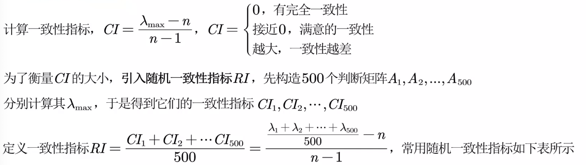

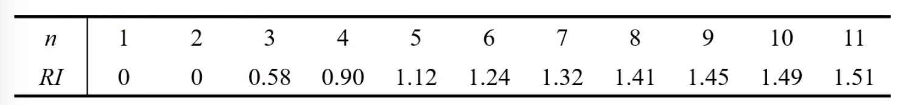

**备注**：公式中的n代表矩阵的阶数。

定义一致性比例：$CR=\frac{CI}{RI}$，如果CR<0.1，则认为矩阵的一致性可以接受；否则要对判断矩阵进行修正。

CI通过计算得到，RI通过查表得到。如果矩阵的一致性比例大于0.1，我们强行调整矩阵使其成为倍数关系就可以了。

#### 一致性矩阵的权重计算方法

若本题中得到的判断矩阵为一致性矩阵，如下：

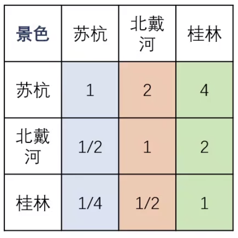

则可通过归一化方法得到权重：

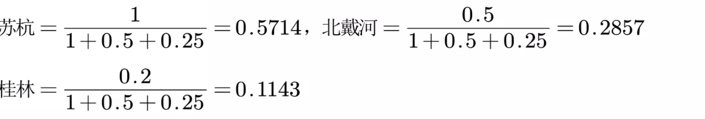

#### 非一致性矩阵的权重计算

若按照原题得到的判断矩阵是非一致性矩阵，如下：

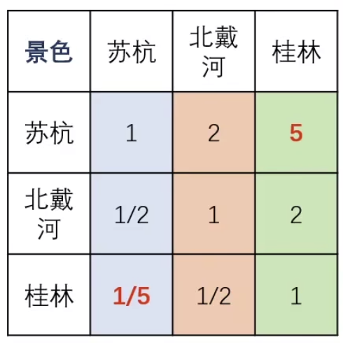

##### 法一

我们应该按照每一列得到不同候选对象的权重(即对于不同对象的权重)然后再求平均得到权重。 

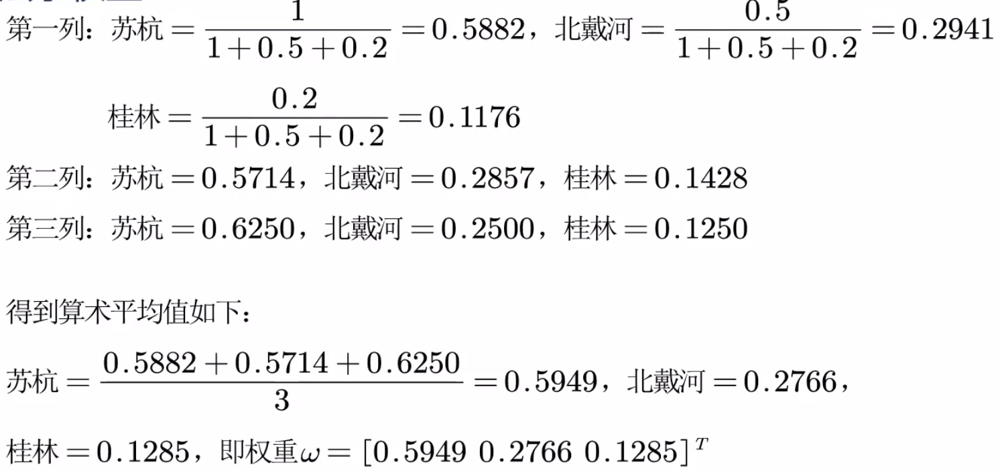

*论文表达*

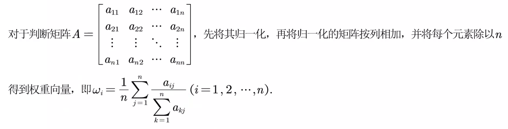

##### 法二：特征值法求权重(重点)

计算判断矩阵的特征值，再进行一致性检验，若得到的$CI<0.1$(即通过一致性检验)，那么选取最大的特征值对应的特征向量进行归一化处理得到的向量就是权重向量。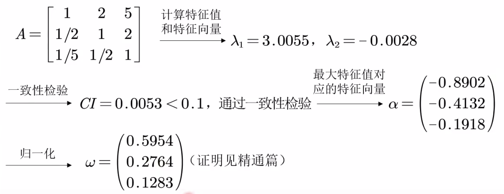

##### 两种求权重方法的比较

在非一致性不大的情况下，两者计算出的权值相差不大，当非一致性较大时，采用特征值法较好，在论文撰写需要凑字数时可以两种方法都用。

接下来，我们继续计算将准则层作为表格的行，方案层作为表格的列，另外一列作为不同的准则层的权重(计算方法同上)，计算填表，得到下表：

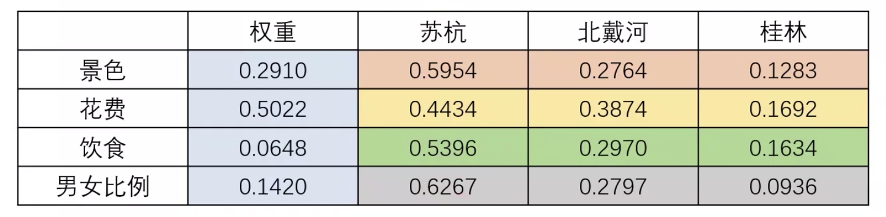

我们也可以将$CI$和$CR/\lambda$添加到表格中，

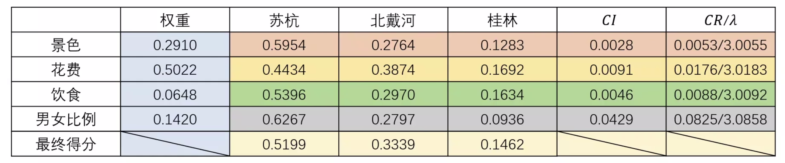

**备注:**$\lambda$是矩阵最大的特征值。

然后进行总层次的一致性检验：

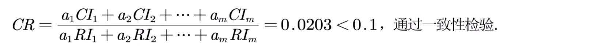

按照公式，每个方案的最终得分计算：

$方案的最终得分=该方案在指标1下的得分\times 指标1的权重+该方案在指标2下的得分\times 指标2的权重+\cdots +该方案在指标n下的得分\times 指标n的权重$

所以，总而言之，层次分析法的关键就是：

1. 找出准则和方案，构建好层次结构模型；
2. 对准则层和方案层求出各自的判断矩阵；
3. 一致性检验：先对每个矩阵进行一致性检验，再对总体进行一致性检验；

4. 根据两层判断矩阵进行加权求和，得到每种方案最后的分数。