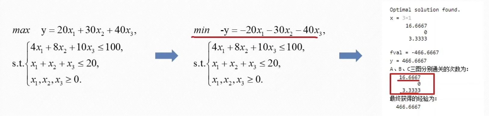
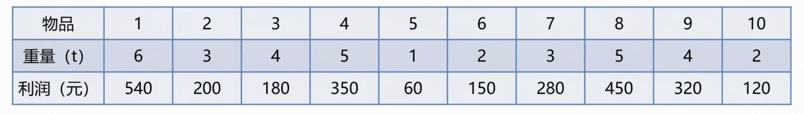
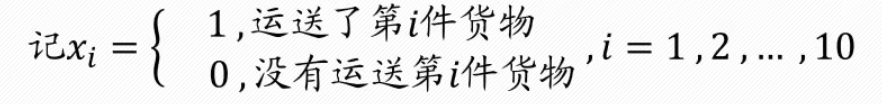
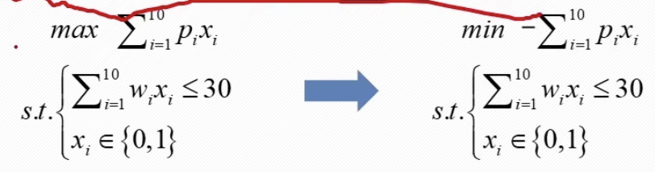
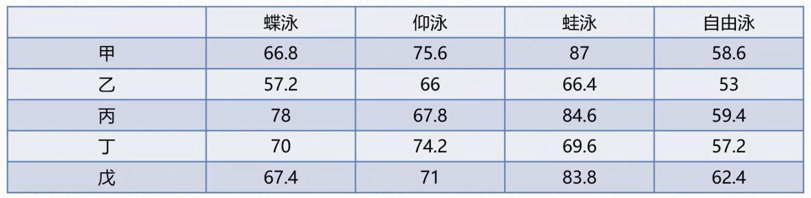
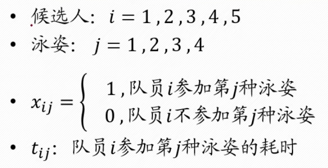
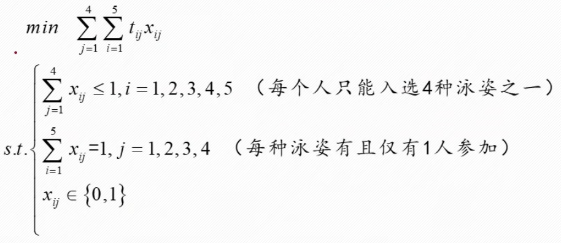

## 整数规划模型

我们借助游戏升级问题来引入。

游戏每天有100点体力，我们可以反复通关A、B、C三张地图来或取经验升级

通关A图可以获得20点经验，通关B图可以获得30点经验，通关C图可以获得40点经验

通关地图会消耗体力，通关A图消耗4点体力，通关B图消耗8点体力，通关C图消耗10点体力

同时A、B、C三图每天加在一起最多通关20次

应该怎么组合通关三张地图的次数，来使得今天获得的经验最大？



根据常识，我们通关次数一定是整数，所以这是一个整数线性规划问题。

```Matlab
%% 游戏升级问题
clc,clear;
f = [-20;-30;-40];
intcon = [1,2,3]
A = [4 8 10; 1 1 1];
b = [100; 20];
lb = zeros(3,1);
[x,fval] = intlinprog(f,intcon,A,b,[],[],lb)
y = -fval
disp('A、B、C三张地图分别通关的次数为：')
disp(x);
disp('最终获得的经验为：')
disp(y);
```


### 整数规划和0-1规划

在规划问题中，有些最优解可能是分数或小数，但对于某些具体问题，常要求某些变量的解必须是整数。比如，变量代表的是机器的台数，工作的人数或装货的车数等。为了满足整数的要求，看似只要把已得的数据四舍五入化整就可以了。实际上化整后的数不见得是可行解和最优解，所以应该有特殊的方法来求解整数规划。

在整数规划中，如果所有变量都限制为整数，则称为**纯整数规划**；如果仅一部分变量限制为整数，则称为**混合整数规划**。整数规划的一种特殊情形是**0-1规划**，它的变数仅限于0或1。

整数规划又分为**线性整数规划**和**非线性整数规划**，线性整数规划可以通过matlab求解；非线性整数规划没有特定算法，只能用近似算法，比如蒙特卡罗模拟，智能算法等。

#### 线性整数规划求解

```matlab
[x,fval] = intlinprog(f,intcon,A,b,Aeq,beq,lb,ub,x0)
```

- f：目标函数的系数向量(必须是最小值形式下的)
- intcon：intcon中的值指示决策变量x中应取整数值的分量
- A, b：不等式约束条件的变量系数矩阵和常数项矩阵(必须是$\le$形式)
- Aeq, beq：等式约束条件的系数矩阵和常数项矩阵
- lb, ub：决策变量的最小取值和最大取值
- intcon：决策变量如果有3个，$x_1,x_2,x_3$，若$x_1$和$x_3$是整数，则intcon=[1,3]
- 线性0-1规划依然使用intlinprog函数求解，只需要限定lb和ub即可

### 典型例题

#### 例1：背包问题

有10件货物要从甲地运送到乙地，每件货物的重量(单位：吨)和利润(单位：元)如下表所示



由于只有一辆最大载重为30t的货车能用来运送货物，所以只能选择部分货物进行运送。

要求确定运送哪些货物，使得运送这些货物的总利润最大。






```Matlab
clc,clear;
c = -[540 200 180 350 60 150 280 450 320 120];
intcon = [1:10];
A = [6 3 4 5 1 2 3 5 4 2]; b = 30;
Aeq = []; beq = [];
lb = zeros(10,1);
ub = ones(10,1);
[x,fval] = intlinprog(c,intcon,A,b,Aeq,beq,lb,ub)
fval = -fval
disp('利润最大值为：')
disp(fval)
```


#### 例题2：指派问题

已知5名游泳候选人的百米成绩，怎么选拔4$\times$100米混合泳接力队伍







```Matlab
%% 指派问题
clc,clear;
% 双下标要转换为单下标：x11->x1,x12->x2,...,x24->x8,...,x54->x20
c = [66.8 75.6 87 58.6 57.2 66 66.4 53 78 67.8 84.6 59.4 70 74.2 69.6 57.2 67.4 71 83.8 62.4]';
intcon = [1:20];
% 每个人最多只能入选一种泳姿，一共5个线性不等式约束
A = [1 1 1 1 0 0 0 0 0 0 0 0 0 0 0 0 0 0 0 0;
     0 0 0 0 1 1 1 1 0 0 0 0 0 0 0 0 0 0 0 0;
     0 0 0 0 0 0 0 0 1 1 1 1 0 0 0 0 0 0 0 0;
     0 0 0 0 0 0 0 0 0 0 0 0 1 1 1 1 0 0 0 0;
     0 0 0 0 0 0 0 0 0 0 0 0 0 0 0 0 1 1 1 1];
b = ones(5,1);
% 每种泳姿都有且只能有一个人入选，一共4个线性等式约束
Aeq = [1 0 0 0 1 0 0 0 1 0 0 0 1 0 0 0 1 0 0 0;
       0 1 0 0 0 1 0 0 0 1 0 0 0 1 0 0 0 1 0 0;
       0 0 1 0 0 0 1 0 0 0 1 0 0 0 1 0 0 0 1 0;
       0 0 0 1 0 0 0 1 0 0 0 1 0 0 0 1 0 0 0 1];
% 亦可Aeq = [eye(4),eye(4),eye(4),eye(4)]，用四个单位矩阵拼接
beq = ones(4,1);
lb = zeros(20,1);
ub = ones(20,1);
[x,fval] = intlinprog(c,intcon,A,b,Aeq,beq,lb,ub)
% reshape(x,4,5)'      (想要优先行排序，后面必须加转置符号。Matlab默认是优先列排序的)
%      0     0     0     1     甲自由泳
%      1     0     0     0     乙蝶泳
%      0     1     0     0     丙仰泳
%      0     0     1     0     丁蛙泳
%      0     0     0     0     戊不参加
reshape(x,4,5)'
disp('整个接力队伍完成时间为：')
disp(fval);
```

