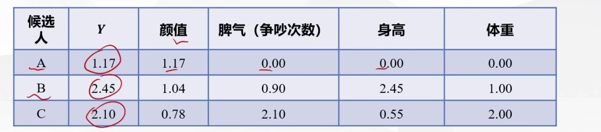
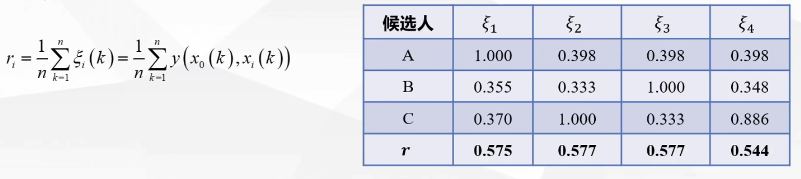

## 灰色关联分析

### 什么是灰色系统？

灰色系统理论是1982年有邓聚龙创立的一门边缘性学科，灰色系统用颜色深浅来反映**信息量的多少**，说一个系统是黑色的，就是说这个系统的信息量太少；说一个系统是白色的，就是说这个系统是清楚的，信息量充足。而处于黑白之间的系统，或说信息不完全的系统，称之为灰色系统，简称灰系统。

### 什么是关联分析？

关联分析，就是系统的分析因素。回答的问题是：某个包含多种因素的系统中，哪些因素是主要的，哪些是次要的；哪些因素影响大，哪些因素影响小；哪些因素是明显的，哪些因素是潜在的；哪些是需要发展的，哪些需要抑制......

现有的因素分析的量化方法，大多是数理统计法如回归分析、方差分析、主要成分分析等，这些方法都有下面几个弱点：

1. 要求大量数据，数据量少很难找到统计规律；
2. 要求分布是典型的(线性的、指数的或对数的)，即使是典型的并非都能处理；
3. 计算工作量大，一般需要计算机帮助；
4. 又是可能出现返厂情况，如正相关判断为负相关，导致正确现象受到歪曲和颠倒。

我国的统计数据十分有限，而且数据灰度较大，许多数据都出现几次大起大落，**没有典型的分布规律**。因此，采用梳理统计方法往往难以奏效。

### 灰色关联分析

灰色关联分析是一种**多因素统计**分析的方法。灰色关联分析方法弥补了采用数理统计方法作系统分析所导致的缺憾。**它对样本量的多少和样本有无规律都同样适用**，而且**计算量小**，更加方便，更不会出现量化结果与定性分析结果不符的情况。

**基本思想**：灰色关联分析的基本思想是**根据序列曲线几何形状的相似程度**来判断其联系是否紧密。曲线越接近，相应序列的关联度就越大，反之就越小。

所以说，想要对一个抽象的系统或现象进行分析，首先要选准反映系统行为特征的数据序列，用来间接地表征系统行为。例如，可以用国民平均接受教育的年数来反映教育的发达程度，用刑事案件的发案率来反映社会治安面貌和社会秩序，用医院的挂号次数来反映古偶明德健康水平等。有了系统行为特征数据和相关因素的数据，即可作出各个序列的图形，从直观上进行分析。总而言之，就是**找到量化的数据来表示抽象的指标**。

### 灰色关联分析的步骤

第4步其实就是对子序列中每个元素与母序列中对应的行的元素求差值得到新的元素构成新的矩阵，然后在新矩阵中找到最大的元素作为b，最小的元素作为a。

### 例题

例题1：已知某地国民生产总值，工业和农业生产总值，原始数据的形式及来源见下表，请分析工业和农业哪个对国民生产总值影响大。

那按照步骤来，第一步定义母序列以及子序列：

在这个问题中讨论的是工农业对国民生产总值的影响，所以工农业相当于一个自变量的角色，国民生产总值相当于一个因变量的角色，那么自然而然，我们就应该把国民生产总值定义为母序列，工业产值和农业产值定义为子序列：

然后第二步进行数据预处理，以消除量纲不同带来的误差：

第三步，根据公式求关联系数：

得到最小差a = 0.01, 最大差b = 0.38。$\rho$一般取0.5。

带入公式就能得到关联系数：

最后一步，求关联度，这里只要简单的把工业产值和农业产值的数据分别求均值进行比较即可：

下面探讨如何将灰色关联分析运用到综合评价问题当中。

例题2：我我们给KUN选对象，还是A、B、C三位候选人(KUN觉得身高165最好，体重在90-100斤最好)

第一步，还是将数据进行正向化处理处理方法同TOPSIS法：

第二步，对正向化后的数据进行预处理，目的还是为了消除量纲不同所带来的屏障：

第三步，这个问题背景是没有给出明确的母序列的，我们很容易知道该问题讨论的是颜值、脾气、身高、体重四方面因素对找对象这一问题的影响，那颜值、脾气、身高、体重的数据就是该问题的自变量，也就是子序列，那么母序列需要我们自己构造，就类似于每位候选人的评分一样，这里我们选择每位候选人的所有指标中的最大值作为母序列的元素，实际上构造母序列的依据有很多，这里取所有指标的最大值只是其中一种，相当于将这个最有指标作为评价的标准，然后将其余评价对象与其进行比较，看之间的相似程度。在实际问题中还可以用平均值，中位数，加权平均值等构造母序列。

第四步，就是求关联系数：

先找到两级最小差和两极最大差。

第五步，计算关联度：

求平均值作为初始的关联度：

最后，计算各指标权重，并得到最终关联度

我们用归一化来计算权重，然后将权重加权到初始关联度上得到得分，最后将得分归一化即可。

