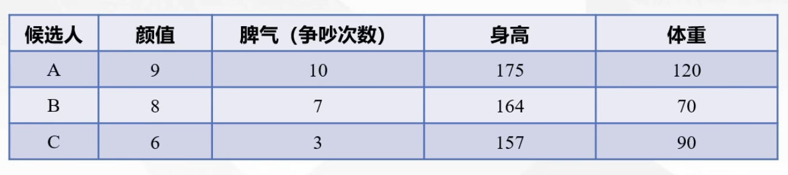

## 熵权法

根据前面的内容我们了解到在评价类问题中往往不同的指标有一个叫权重的东西，之前我们的权重是根据主观或者专家评价得到的，那有没有更客观的方法呢？

我们还是借助之前KUN找对象的例子来引入：

现在我们稍微对数据做出一些改动，让三位候选人的身高相差不多，如图：

现在3人的身高指标相差很小，我们没有必要严格的卡165cm身高，所以可以适当地将身高指标所占的权重降低，这里为了方便我们直接忽略掉升高指标。如果说KUN哥对于体重的要求非常严苛，我们就可以将体重指标所占的权重增大。

现在引入熵权法的定义。

熵权法其实最早源自于物理学，按照信息论基本原理的解释，信息是系统有序程度的一个度量，熵是系统无序程度的一个度量；根据信息熵的定义，对于某项指标，可以用熵值来判断某个指标的离散程度，其信息熵值越小，指标的离散程度雨大，该指标对综合评价的影响(即权重)就越大，如果某项指标的值全部相等，则该指标在综合评价中不起作用。因此，可以利用信息熵这个工具，计算出各个指标的权重，为多指标综合评价提供依据。

熵权法本身是一种客观的赋权方法，它可以**只依靠数据本身计算出权重**。依据的原理是：指标的变异程度越小，所反映的信息量也越少，其对应的权值也应该越低。

### 熵权法使用步骤

1. 数据标准化

   

结合例题来看：

我们依然使用修改前的数据。首先还是将原始指标矩阵正向化

然后进行正向矩阵标准化

再计算概率矩阵，说白了就是将每个指标的数据进行归一化，使得表格这种每一列的数相加和为1。

最后，我们来计算每个指标的熵权

先计算信息熵：$e_j=-\frac{1}{\ln{n}}\sum_{i=1}^{n}p_{ij}\ln(p_{ij})$。

注意信息熵其实反映的是数据的有序性。通过计算信息效用值$d_j=1-e_j$(其实也算是一个正向化的小步骤)，我们可以知道信息效用值越大，权重越大。对信息效用值归一化得到熵权：$W_j=\frac{d_j}{\sum_{j=1}^{m}d_j}$。

这就是这个题目下通过熵权法得到的每个指标的权重以及对应的最终端出来的得分。

