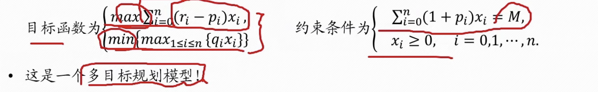

## 线性规划

### 模型引出

生活中我们常会遇到XXX共有多少，应该怎么样去安排或者分配，使得......最大/最小/最优。例如，若要生产两种机床，利润分别为XXX，机器有不同的损耗费用，不同的工作时间，怎么安排生产能够让总利润最大呢？或者例如，若总资产为A，有n种资产可以进行配置，每种资产配置的平均收益率为XXX，风险损失率为XXX，怎么组合投资使得收益最大，风险最小？又例如，若产品有n个产地和p个销售地，需要从产地运输到销售地，各产地的产量是XXX，各销售地的需求量是XXX，不同产地运输到不同销售地的运价是XXX，怎么调运才能是总运费最省？再比如，不同类型的车辆承载量不同，工地各点之间许安排车辆运输，工地里有 多条线路，满足用工需求的情况下，怎么安排车辆能使车次安排最合理？

以上是一些常见的**运筹优化问题**，也是数学建模比赛中比较常见的题型，简单来说就是求**最大值/最小值即极值**的问题，线性规划就是解决这些问题常用的工具之一。

### 线性规划

**线性规划**(Linear Programming)，是运筹学中研究较早、发展较快、应用广泛、方法较成熟的一个重要分支，是辅助人们进行科学管理的一种数学方法，是研究线性约束条件下**线性目标函数的极值问题的数学理论和方法**。

#### 线性规划模型的三要素

1. **决策变量**：问题中要确定的**未知量**，用于表明规划问题中的用数量表示的方案、措施等，可有决策者决定和控制；
2. **目标函数**：决策变量的函数，优化目标通常是求该函数的最大值或最小值；
3. **约束条件**：决策变量的取值受到的约束和限制条件，通常用含有决策变量的等式或不等式表示。

#### 线性规划模型建立步骤

1. 找出决策变量
2. 确定目标函数
3. 找出要满足的约束条件

#### 线性规划的表现形式

- 一般形式或者代数形式：

- 简写形式：

- 矩阵表现形式：

#### 线性规划的模型特点

- 要解决的问题是**优化类**的
- 目标函数和约束条件都是决策变量的**线性函数**，即决策变量的次数均为一次

#### 线性规划模型求解

- 单纯形法：手算
- 运用MATLAB，Python的相关函数进行求解

#### 例题：1998年国赛A题

总结一下，就是用给定资金M，有选择的购买若干种资产或者存入银行生息，使净收益尽可能大，总体风险尽可能小。

决策变量：投资不同项目$s_i$的为$x_i(i=1,2,\cdots,n)$

目标函数：使净收益Q尽可能大，总风险尽可能小

约束条件：总资金M有限，每一笔投资都是非负数

而且，已知目标函数和约束条件都是决策变量的**线性函数**

##### 模型建立

多目标规划，将其中一个目标转化为约束条件进行求解，可以把多目标规划变成一个目标的线性规划，比如这里可以将目标函数$min\{max_{1\le i\le n}\{q_ix_i\}\}$转化为约束条件：$\frac{q_ix_i}{M}\le a$，即总体风险小于某个常数。

注意：

目标函数一定要求最小值，如果原本为求最大值，可以添加符号转化为求最小值的问题

