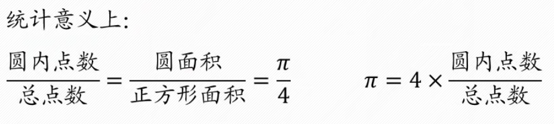
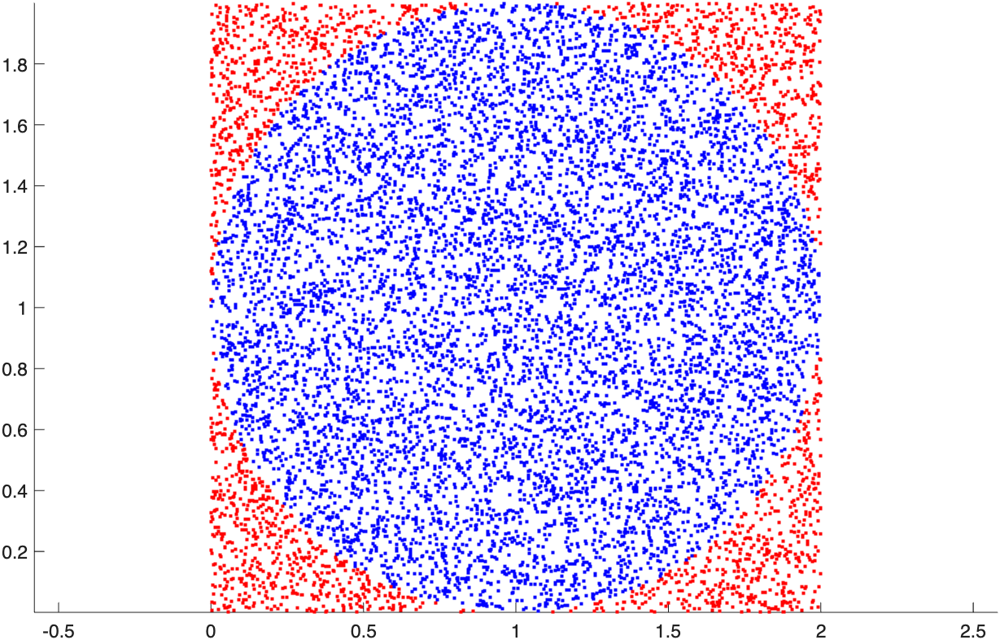
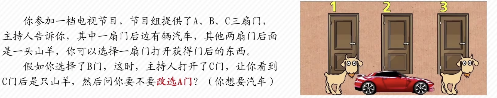
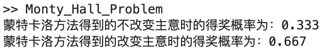
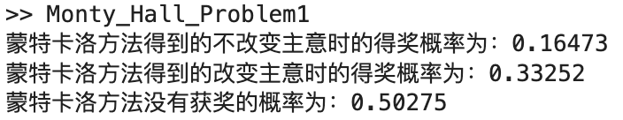

## 蒙特卡洛法

### 模型引入

我们都知道圆周率$\pi$是个无理数，那如果我们能求得面积的值，自然就能求得$\pi$的近似值了。那么怎么求圆的面积呢？

我们可以作一个外方内圆，正方形的面积是很容易知道的。现在我们在正方形内随机撒大量的点，有些落在圆内，有些落在圆外。



### 蒙特卡洛法

蒙特卡洛法由“曼哈顿计划”的成员S.M.乌拉姆和J.冯诺依曼首先提出。数学家冯诺依曼用驰名世界的赌城摩纳哥的蒙特卡洛来命名这种方法。在此前，法国数学家蒲丰就已经用这种方法进行投针试验求圆周率，这被认为是蒙特卡洛法的起源。

蒙特卡洛法又称统计模拟法，是一种随机模拟方法。蒙特卡洛法不是一种算法，而是一种思想，或者是用于**求近似解**的一种方法。只要求解的问题**与概率模型有关**，我们就可以采用这种方法。在数学建模领域，蒙特卡洛法没有通用的代码，每个问题对应的代码都是不同的。

下面来看看刚刚求圆周率问题的代码

```matlab
% 参数初始化：投放10000个点，圆的半径为1，圆心的坐标为(1,1)
% 初始时还未投放点，有0个点在圆内
p = 10000; r = 1; x0 = 1; y0 = 1; n = 0;
hold on % 保持绘图窗口，多次绘画
for i = 1:p % 对于要投放的总共p个点
% rand函数产生在(0,1)之间的随机数；rand函数还有其他多种形式
	px = rand*2; % 随机生成该点的横坐标
	py = rand*2; % 随机生成该点的纵坐标
	% 该点在圆内，则颜色设为蓝色，变量n+1;在圆外则设为红色
	if (px-1)^2 + (py-1)^2 < 1 % 横纵坐标的平方和小于半径，则在圆内
		plot(px,py,'.','Color',"b");
		n = n+1;
	else
		plot(px,py,'.','Color',"r");
	end
end
axis equal % 绘图时横坐标单位长度相同，便于观察圆
s = (n/p)*4;
pi0 = s;
```

在MATLAB中画出了这样的图像：



最终求出的圆周率的近似值为3.1420。每次运行代码的结果都不同。

#### 三门问题



一般人的直觉：

在三个门中选一个，主持人排除掉一个错误答案，还剩一个。此时的命题变为：

- 条件：两个门里，一个门后面是汽车，一个门后面是山羊，任选一个。

- 问题：交换选择是否能提高胜率？

- 答案：不能，二选一的问题，选哪个门都是50%的概率成功。

那事实是这样吗？我们用蒙特卡洛法来模拟一下。

```Matlab
%% 1. 在成功的条件下的概率
n = 100000; % n代表蒙特卡洛模拟重复次数
a = 0; % a表示不改变主意时能赢得汽车的次数
b = 0; % b表示改变主意是能赢得汽车的次数
for i = 1:n % 开始模拟n次
	x = randi([1,3]);
	y = randi([1,3]);
% 分两种情况讨论x = y和x != y
	if x == y % 如果x和y相同，那么我们只有不改变主意时才能赢
		a = a + 1; b = b + 0;
		else
		a = a + 0; b = b + 1;
	end
end
disp(['蒙特卡洛方法得到的不改变主意时的得奖概率为：', num2str(a/n)]);
disp(['蒙特卡洛方法得到的改变主意时的得奖概率为：', num2str(b/n)]);
```

出人意料，得到了下面的结果：



我们可以看到，改变主意得奖的概率更大。我们把失败的情况考虑进去，再进行一次模拟。

```matlab
n = 100000; % n代表蒙特卡洛模拟重复次数
a = 0; % a表示不改变主意是能赢得汽车的次数
b = 0; % b表示改变主意能赢得汽车的次数
c = 0; % c表示没有得奖的次数
for i = 1:n % 开始模拟n次
    x = randi([1,3]);
    y = randi([1,3]);
    change = randi([0,1]); % 0表示不改变主意，1表示改变主意
    % 下面分两种情况讨论：x = y和x != y
    if x == y
        if change == 0
            a = a + 1;
        else 
            c = c + 1;
        end
    else
        if change == 0
            c = c + 1;
        else
            b = b + 1;
        end
    end
end
disp(['蒙特卡洛方法得到的不改变主意时的得奖概率为：', num2str(a/n)]);
disp(['蒙特卡洛方法得到的改变主意时的得奖概率为：', num2str(b/n)]);
disp(['蒙特卡洛方法没有获奖的概率为：', num2str(c/n)]);
```



这就是经过蒙特卡洛法模拟得到的近似概率，印证了改变主意的获奖概率高的结论。

蒙特卡洛法在非线性规划领域求初始值是计算是最精确的，后面会接触到。