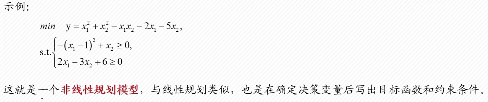
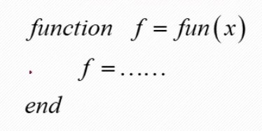
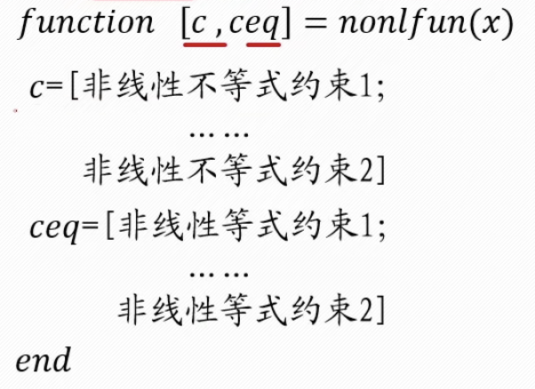
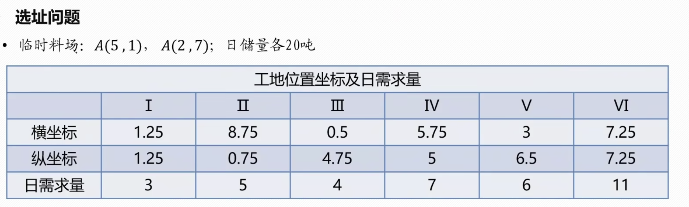
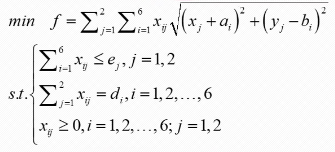
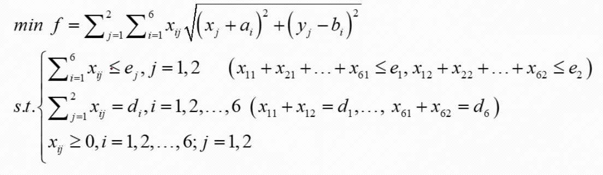
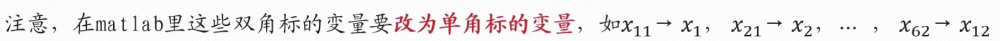

## 非线性规划

除了线性规划模型，优化类问题往往还有更复杂的。比如常见的收益率、传播率、经济增长的规划问题，往往涉及到$\frac 1 x$的形式，属于非线性。一些设计空间运动问题中会用到三角函数、指数函数等形式，也是非线性问题，还有运输问题会涉及地点间的距离，也是非线性问题。

### 非线性规划

非线性规划是一种求解目标函数或约束条件中有一个或几个非线性函数的最优化问题的方法。尤其是在“最优设计”方面，它提供了数学基础和计算方法，因此有重要的实用价值。

#### 非线性规划模型特点

- 模型中至少一个变量是非线性，即包含$x^2,e^x,\frac 1 x,sinx,log_2x$等形式。
- 线性规划通常是有求准确解的方法(单纯形法)的，它的最优解只存在于可行域的边界上；非线性规划的最优解(若存在)可能在其可行域的任何一点到达，目前非线性规划还**没有适合各种问题的一般解法**，各种方法都有其特定的适用范围。

- 针对数学建模来说，我们掌握matlab的函数求近似解即可。

#### 非线性规划模型的标准型

和线性规划一样，标准型也分为目标函数和约束条件，其中目标函数必须用最小值来表示，约束条件包含线性不等式和非线性不等式，所有不等式必须用小于等于号。最后还要有x的取值范围、

#### 非线性规划求解Matlab函数

- fmincon函数:[x fval]=fmincon（fun,x0,A,b,Aeq,beq,ub,nonlcon,option)
  - fun：把目标函数定义为一个**单独的函数文件**(min)
  - x0：决策变量的初始值
  - A, b：线性约束不等式变量系数矩阵和常数项矩阵($\le$或$<$)
  - Aeq, beq：线性约束的等式变量系数矩阵和常数项矩阵
  - lb, ub：决策变量的最小取值和最大取值
  - nonlcon：非线性约束，包括不等式和等式
  - option：求解非线性规划使用的方法

注意事项：

- 非线性规划中对于初始值x0的选取非常重要，因为非线性规划的算法求解出来的是一个局部最优解。如果要求全局最优解，有两个思路：
  1. 给定不同的初始值，在里面找到一个最优解；
  2. 先用**蒙特卡洛模拟**，得到一个蒙特卡洛解，然后将这个解作为初始值来求最优解。
- option选项可以给定求解的算法，一共有五种，interior-point(内点法)、trust-region-reflective(信赖域反射法)、sqp(序列二次规划法)、sqp-legacy(约束非线性优化算法)、active-set(有效集法)。不同的算法有其各自的优缺点和适用情况，我们可以改变求解的算法来对比求解的结果。在Matlab中若不填写option，则默认使用内点法，内点法的效果目前来说是最好的，在数学建模中，我们可以用5种方法分别求解，然后将结果进行比较。
- fun表示目标函数，我们要编写一个独立的“m文件”储存目标函数。
  

-  nonlcon表示非线性部分的约束，也要编写一个独立的“.m”文件用于储存非线性约束条件

- 决策变量下标要改为括号，也就是将决策变量按顺序排列组成向量，需要用到第i个决策变量时用x(i)调用。
- 若不存在某种约束，可以用“[]”替代，若后面全为“[]”且option使用默认，后面的“[]”可以省略。

### 例题：

(1)试制定每天的供应计划，即从两料场分别向各工地运送多少吨水泥，是总的吨千米数最小？(吨千米指运送水泥的质量与运输距离的乘积)

(2)为了进一步减少吨千米数，打算舍弃两个临时料场，改建两个新的，日储量各为20吨，问应建在何处，节省的吨千米数为多大？

#### 解题步骤

1. 确定决策变量
   设第i个工地的坐标为$(a_i,b_i)$，水泥日用量为$d_i$，$i=1,2,\cdots,6$；料场位置$(x_i,y_i)$，日储量$e_j$，$j=1,2$；从料场j运向工地i的运送量为$x_{ij}$

2. 确定约束条件

   料场水泥运输总量不超过其日储量：$\sum_{i=1}^6x_{ij}\le e_j,j=1,2$

   两个料场向某工地运输量之和等于该工地水泥日用量：$\sum_{j=1}^2x_{ij}=d_i,i=1,2,\cdots,6$

3. 确定目标函数
   总吨千米数最小，即运送量乘以运送距离求和最小$min f = \sum_{j=1}^2\sum_{i=1}^6x_{ij}\sqrt{(x_j-a_i)^2+(y_j-b_i)^2}$

4. 建立模型

   

5. 求解

   对于第一问，由于料场位置已知，故决策变量仅为$x_{ij}$，为线性规划模型

   对于第二问，新料场位置未知，所以$x_j$和$y_j$均为变量，且不是线性的，故为非线性规划模型

   共有8个约束

   

   